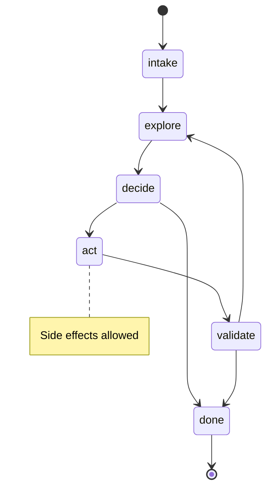

# agent-go

[](https://pkg.go.dev/github.com/felixgeelhaar/agent-go)
[](https://goreportcard.com/report/github.com/felixgeelhaar/agent-go)
[](https://opensource.org/licenses/MIT)

**Build trustworthy AI agents in Go.** A state-driven runtime where intelligence is constrained by design, not hope. Works great for a **single agent** — scales to **multi-agent systems** when you're ready.

```go
engine, _ := agent.New(
    agent.WithTools(readFile, writeFile),
    agent.WithPlanner(llmPlanner),
    agent.WithBudget("tool_calls", 50),
)

run, _ := engine.Run(ctx, "Summarize all markdown files in ./docs")
```

---

## Why agent-go?

Most agent frameworks treat safety as an afterthought. agent-go makes **trust the product**:

| Problem | agent-go Solution |
|---------|-------------------|
| Agents run arbitrary code | **State machine** constrains what tools run when |
| No visibility into decisions | **Audit ledger** records every action |
| Runaway costs | **Budget enforcement** with hard limits |
| Dangerous operations | **Approval workflows** for destructive tools |
| Untestable LLM behavior | **Deterministic mode** with scripted planners |
| Python's GIL limits scale | **Native Go concurrency** for high throughput |

**The key insight**: Structure agent behavior through constraints, not prompts.

### Platform Capabilities

agent-go is more than a single-agent engine — it's a **policy-aware, event-driven runtime for multi-agent systems**:

| Capability | What It Does |
|-----------|-------------|
| **Multi-agent coordination** | DelegateTool wraps child engines as tools. TaskContext shares state across agent hierarchies. |
| **Agent protocol** | Message envelope with correlation IDs, capability discovery, trust boundaries, request-reply and broadcast patterns. |
| **Event streaming** | `Stream()` returns a real-time channel of 12 event types. Powers dashboards, debugging, and orchestration. |
| **MCP integration** | Expose tools via Model Context Protocol with full policy enforcement (approval, budgets, audit trail). |
| **Replay and fork** | Replay historical runs from events. Fork runs at any step for simulation and testing. |
| **Shared memory** | Cross-agent TaskContext with thread-safe shared variables, evidence, and artifact references. |
| **WASM sandbox** | Isolate tool execution with wazero (memory limits, time limits, filesystem restrictions). |
| **Dashboard** | Real-time web UI with SSE event stream, run history, and evidence viewer. |
| **CLI (agentctl)** | `run`, `validate`, `visualize`, `repl` commands for development and debugging. |
| **134 contrib modules** | Storage backends (SQLite, PostgreSQL, Redis, etc.), 118 tool packs, 7 LLM planner providers. |

> **See it in action**: `go run ./example/flagship` — 3 agents, shared state, streaming, persistence, budgets, and approval in one program.

### State Machine

Every agent runs within a canonical state graph. Side effects only happen in `act`:



### Architecture

```
interfaces/api/     → Public API (5 lines to get started)
application/        → Engine (Run, Stream, Replay, Fork)
domain/             → Pure types (State, Decision, Tool, Policy, Protocol)
infrastructure/     → Implementations (statekit, fortify, storage, planner)
contrib/            → 134 optional modules (storage, tools, enhancements)
```

---

## Quick Start

### Installation

```bash
go get github.com/felixgeelhaar/agent-go
```

### Your First Agent (5 minutes)

```go
package main

import (
    "context"
    "encoding/json"
    "fmt"
    "log"

    agent "github.com/felixgeelhaar/agent-go/interfaces/api"
    "github.com/felixgeelhaar/agent-go/domain/tool"
)

func main() {
    // 1. Create a simple tool
    greetTool := agent.NewToolBuilder("greet").
        WithDescription("Greets a person by name").
        WithAnnotations(agent.Annotations{ReadOnly: true}).
        WithHandler(func(ctx context.Context, input json.RawMessage) (tool.Result, error) {
            var in struct{ Name string `json:"name"` }
            json.Unmarshal(input, &in)
            output, _ := json.Marshal(map[string]string{
                "message": fmt.Sprintf("Hello, %s!", in.Name),
            })
            return tool.Result{Output: output}, nil
        }).
        MustBuild()

    // 2. Create a scripted planner (for testing - swap with LLM in production)
    planner := agent.NewScriptedPlanner(
        agent.ScriptStep{
            ExpectState: agent.StateIntake,
            Decision:    agent.NewTransitionDecision(agent.StateExplore, "starting"),
        },
        agent.ScriptStep{
            ExpectState: agent.StateExplore,
            Decision:    agent.NewCallToolDecision("greet", json.RawMessage(`{"name":"World"}`), "greeting user"),
        },
        agent.ScriptStep{
            ExpectState: agent.StateExplore,
            Decision:    agent.NewFinishDecision("completed", json.RawMessage(`{"status":"done"}`)),
        },
    )

    // 3. Build and run the engine
    engine, err := agent.New(
        agent.WithTool(greetTool),
        agent.WithPlanner(planner),
        agent.WithMaxSteps(10),
    )
    if err != nil {
        log.Fatal(err)
    }

    run, err := engine.Run(context.Background(), "Say hello")
    if err != nil {
        log.Fatal(err)
    }

    fmt.Printf("Status: %s\n", run.Status)
    fmt.Printf("Result: %s\n", run.Result)
}
```

Run it:
```bash
go run main.go
# Output:
# Status: done
# Result: {"status":"done"}
```

---

## Core Concepts

### State Machine

Agents operate within a **canonical 7-state lifecycle**. Each state has explicit semantics:

```
intake → explore → decide → act → validate → done
                     ↓                  ↓
                  failed ←──────────────┘
```

| State | Purpose | Side Effects |
|-------|---------|--------------|
| `intake` | Parse and normalize the goal | None |
| `explore` | Gather information (read-only tools) | None |
| `decide` | Choose next action | None |
| `act` | Execute side-effecting tools | **Yes** |
| `validate` | Verify results | None |
| `done` | Success (terminal) | None |
| `failed` | Failure (terminal) | None |

**Why this matters**: A tool marked `Destructive` can only run in `act` state. Period.

### Tools

Tools are the agent's capabilities. Each tool declares its behavior through **annotations**:

```go
writeTool := agent.NewToolBuilder("write_file").
    WithAnnotations(agent.Annotations{
        ReadOnly:    false,      // Modifies state
        Destructive: true,       // May cause irreversible changes
        Idempotent:  false,      // Not safe to retry
        RiskLevel:   agent.RiskHigh,
    }).
    WithHandler(writeHandler).
    MustBuild()
```

Annotations drive runtime behavior:
- `ReadOnly` tools can run in `explore` and `validate`
- `Destructive` tools require approval (if configured)
- `Idempotent` tools get automatic retry on failure
- `Cacheable` results are memoized

### Planners

Planners decide what the agent does next. **Swap implementations without changing agent code**:

```go
// Testing: deterministic, no LLM needed
planner := agent.NewScriptedPlanner(steps...)

// Development: local models via Ollama
planner, _ := ollama.New(ollama.WithModel("llama3"))

// Production: Claude, GPT-4, Gemini
planner, _ := anthropic.New(anthropic.WithModel("claude-sonnet-4-20250514"))
```

### Policies

Hard limits that **cannot be overridden by the LLM**:

```go
engine, _ := agent.New(
    // Budget: Stop after 100 tool calls, no matter what
    agent.WithBudget("tool_calls", 100),

    // Approval: Human must approve destructive operations
    agent.WithApprover(myApprover),

    // Eligibility: read_file only in explore, write_file only in act
    agent.WithToolEligibility(eligibility),
)
```

---

## Features

### LLM Providers

Pluggable providers for all major LLMs (via contrib modules):

```go
import "github.com/felixgeelhaar/agent-go/contrib/planner-llm/providers/anthropic"
import "github.com/felixgeelhaar/agent-go/contrib/planner-llm/providers/openai"
import "github.com/felixgeelhaar/agent-go/contrib/planner-llm/providers/gemini"
import "github.com/felixgeelhaar/agent-go/contrib/planner-llm/providers/ollama"

// Each provider implements the same interface
provider, _ := anthropic.New(anthropic.WithAPIKey(os.Getenv("ANTHROPIC_API_KEY")))
provider, _ := openai.New(openai.WithAPIKey(os.Getenv("OPENAI_API_KEY")))
provider, _ := gemini.New(gemini.WithAPIKey(os.Getenv("GEMINI_API_KEY")))
provider, _ := ollama.New(ollama.WithBaseURL("http://localhost:11434"))
```

### Tool Packs

Pre-built tool collections for common domains (94 packs available via contrib modules):

```go
import "github.com/felixgeelhaar/agent-go/contrib/pack-database"
import "github.com/felixgeelhaar/agent-go/contrib/pack-git"
import "github.com/felixgeelhaar/agent-go/contrib/pack-kubernetes"
import "github.com/felixgeelhaar/agent-go/contrib/pack-cloud"

// Database: query, execute, schema inspection
dbPack := database.New(db, database.WithMaxRows(1000))

// Git: status, log, diff, commit
gitPack := git.New("/path/to/repo", git.WithAllowCommit(true))

// Kubernetes: get, list, logs, apply
k8sPack := kubernetes.New(client, kubernetes.WithNamespace("production"))

// Cloud: S3/GCS/Azure blob operations
cloudPack := cloud.New(provider, cloud.WithBucket("my-bucket"))
```

**Categories**: Archive, Text Processing, Data Formats, Code Analysis, Utilities, Web & Network, Infrastructure, Messaging, AI & ML, Media & Documents, Integrations, Security, Data & Analytics, Geo & Localization, Validation & Parsing.

### Observability

OpenTelemetry integration for traces and metrics (via contrib/otel):

```go
import "github.com/felixgeelhaar/agent-go/contrib/otel"

tracer, _ := otel.NewTracer("my-agent",
    otel.WithOTLPEndpoint("localhost:4317"),
)

engine, _ := agent.New(
    agent.WithMiddleware(otel.TracingMiddleware(tracer)),
)

// Automatic spans for: tool execution, state transitions, planner calls
// Automatic metrics for: tool_duration, run_duration, budget_usage
```

### Security

Input validation, secret management, and audit logging (via contrib packs):

```go
import "github.com/felixgeelhaar/agent-go/contrib/pack-validate"
import "github.com/felixgeelhaar/agent-go/contrib/pack-secrets"

// Validate tool inputs with pack-validate
validator := validate.NewValidator(
    validate.WithRule("path", validate.NoPathTraversal()),
    validate.WithRule("query", validate.NoSQLInjection()),
)

// Manage secrets with pack-secrets
secretMgr := secrets.NewEnvManager(secrets.WithPrefix("AGENT_"))
```

### Distributed Execution

Scale across multiple workers (via contrib/distributed):

```go
import "github.com/felixgeelhaar/agent-go/contrib/distributed"

// Create queue (memory for dev, Redis/NATS for prod)
q := distributed.NewMemoryQueue()

// Create distributed lock
l := distributed.NewMemoryLock()

// Start workers
worker := distributed.NewWorker(distributed.WorkerConfig{
    Queue:       q,
    Lock:        l,
    Concurrency: 4,
})
worker.Start(ctx)
```

---

## Architecture

```
agent-go/
├── go.mod                     # Core module (lean dependencies)
├── go.work                    # Go workspace file
│
├── domain/                    # Core domain (no external deps)
│   ├── agent/                 # Run, State, Decision, Evidence
│   ├── tool/                  # Tool, Annotations, Schema, Registry
│   ├── policy/                # Budget, Approval, Eligibility
│   └── ledger/                # Audit trail
│
├── application/               # Orchestration
│   └── engine.go              # Main engine service
│
├── infrastructure/            # Core implementations
│   ├── storage/memory/        # In-memory stores
│   ├── planner/               # Mock & scripted planners
│   └── resilience/            # Circuit breaker, retry
│
├── interfaces/api/            # Public API
│
├── contrib/                   # Optional modules (separate go.mod each)
│   ├── storage-*/             # Storage backends (postgres, redis, mongodb...)
│   ├── pack-*/                # Tool packs (94 packs across 15 categories)
│   ├── planner-llm/           # LLM providers (anthropic, openai, gemini...)
│   ├── otel/                  # OpenTelemetry integration
│   ├── distributed/           # Queues, locks, workers
│   ├── mcp/                   # Model Context Protocol support
│   ├── dashboard/             # Web dashboard
│   └── approval-slack/        # Slack approval integration
│
└── example/                   # Examples
```

---

## Comparison

| Feature | agent-go | LangChain | AutoGPT | CrewAI |
|---------|----------|-----------|---------|--------|
| Language | Go | Python | Python | Python |
| Type Safety | Compile-time | Runtime | Runtime | Runtime |
| State Machine | Built-in | Manual | None | None |
| Policy Enforcement | First-class | Partial | None | Partial |
| Audit Trail | Built-in | Manual | None | None |
| Deterministic Testing | ScriptedPlanner | Difficult | Difficult | Difficult |
| Concurrency | Native goroutines | GIL-limited | Limited | Limited |
| Memory Footprint | ~10MB | ~100MB+ | ~200MB+ | ~150MB+ |

---

## Documentation

- **[Quick Start Guide](docs/quickstart.md)** - Your first agent in 5 minutes
- **[Concepts](docs/concepts/)** - States, tools, planners, policies
- **[Architecture](docs/architecture/)** - DDD structure, layer responsibilities
- **[Integration Guides](docs/integrations/)** - LLM providers, packs, security
- **[Examples](example/)** - Progressive examples from minimal to production
- **[API Reference](https://pkg.go.dev/github.com/felixgeelhaar/agent-go)** - GoDoc

---

## Examples

| Example | Description | Complexity |
|---------|-------------|------------|
| [01-minimal](example/01-minimal/) | Absolute minimum working agent | Beginner |
| [02-tools](example/02-tools/) | Custom tool creation | Beginner |
| [03-policies](example/03-policies/) | Budgets and approvals | Intermediate |
| [04-llm-planner](example/04-llm-planner/) | Real LLM integration | Intermediate |
| [06-distributed](example/06-distributed/) | Multi-worker setup | Advanced |
| **[flagship](example/flagship/)** | **Full platform demo: 3 agents, streaming, persistence** | **Advanced** |
| [fileops](example/fileops/) | File operation tools | Beginner |
| [webscraper](example/webscraper/) | Web scraping agent | Intermediate |
| [customer-support](example/customer-support/) | Customer support agent | Intermediate |
| [devops-monitor](example/devops-monitor/) | DevOps monitoring agent | Advanced |
| [governed-adaptivity](example/governed_adaptivity/) | Governed adaptive behavior | Advanced |

---

## Development

```bash
# Build
go build ./...

# Test with race detection
go test -race ./...

# Coverage
coverctl check --fail-under=80

# Security scan
nox scan . --severity-threshold=high

# Lint
golangci-lint run ./...
```

---

## Dependencies

**Core module** (lean, ~15 dependencies):
- **[statekit](https://github.com/felixgeelhaar/statekit)** - Statechart execution engine
- **[fortify](https://github.com/felixgeelhaar/fortify)** - Resilience patterns (circuit breaker, retry)
- **[bolt](https://github.com/felixgeelhaar/bolt)** - High-performance structured logging
- Standard library for everything else

**Contrib modules** add dependencies only when imported:
- Storage backends bring their drivers (pgx, mongo-driver, redis, etc.)
- LLM providers bring their SDKs (anthropic-sdk, openai-sdk, etc.)
- Tool packs bring domain-specific libraries as needed

---

## Contributing

Contributions are welcome! Please read [CONTRIBUTING.md](CONTRIBUTING.md) for guidelines.

---

## License

MIT License - see [LICENSE](LICENSE) for details.
